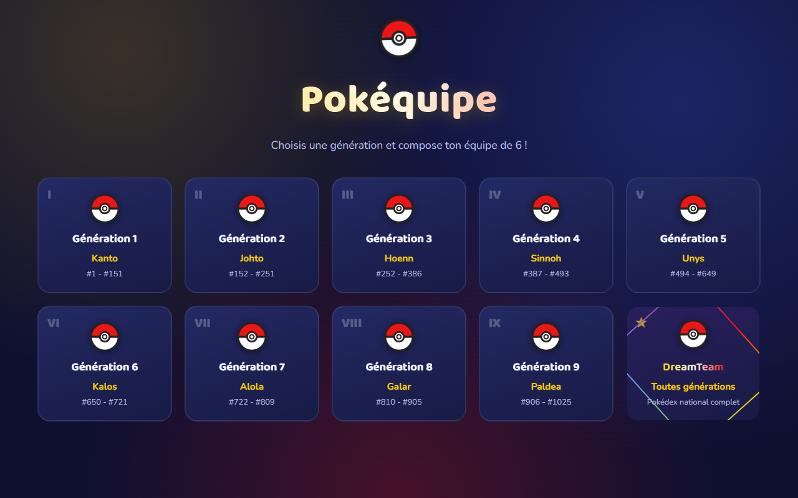
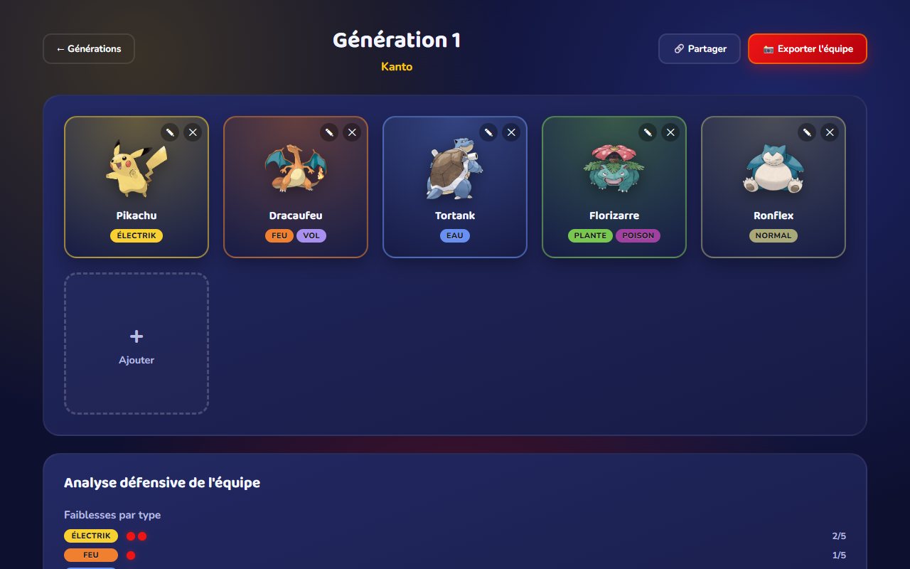
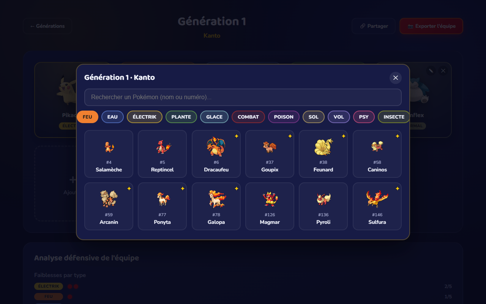
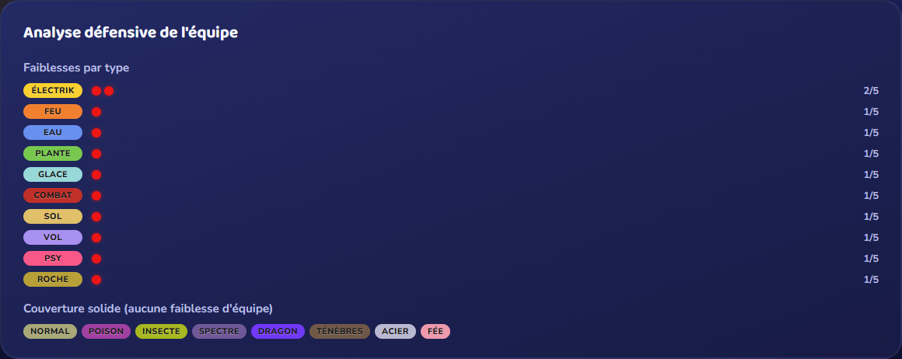

<div align="center">

# Pokéquipe

**Compose ton équipe de 6 Pokémon, génération par génération, et partage-la.**

Sélection par génération (Kanto à Paldea + un mode "Pokédex complet"), recherche et filtre par type, gestion des formes alternatives (Méga, régionales, Gigamax), analyse défensive de l'équipe, partage par lien et export en image — sans backend, tout en local.

[](https://github.com/JulBea/Pok-quipe/actions/workflows/ci.yml)
[](https://www.typescriptlang.org/)
[](https://react.dev/)
[](https://vite.dev/)
[](https://graphql.org/)
[](https://vitest.dev/)
[](LICENSE)

</div>

---

## Sommaire

- [Aperçu](#aperçu)
- [Fonctionnalités](#fonctionnalités)
- [Architecture](#architecture)
- [Stack technique](#stack-technique)
- [Démarrage rapide](#démarrage-rapide)
- [Structure du projet](#structure-du-projet)
- [Roadmap](#roadmap)

## Aperçu

<table>
<tr>
<td width="50%"></td>
<td width="50%"></td>
</tr>
<tr>
<td width="50%"></td>
<td width="50%"></td>
</tr>
</table>

Pokéquipe est une application front-end qui interroge l'API publique [PokeAPI](https://pokeapi.co) (GraphQL) pour construire, génération par génération, une équipe de 6 Pokémon. Pas de backend : la persistance se fait en `localStorage`, et le partage d'équipe passe par une URL auto-suffisante — l'app reste entièrement statique et déployable sur n'importe quel hébergeur de fichiers.

## Fonctionnalités

**Composition d'équipe**
- 9 générations (Kanto à Paldea) + un mode "DreamTeam" sur le Pokédex national complet
- Recherche par nom/numéro et filtre par type dans le sélecteur
- Gestion des formes alternatives (Méga, Méga X/Y, Alola, Galar, Hisui, Paldea, Gigamax) par Pokémon
- Réorganisation de l'équipe par glisser-déposer
- Persistance automatique par génération (`localStorage`), une équipe indépendante par génération

**Analyse défensive**
- Calcul, à partir d'une matrice d'efficacité des 18 types, des faiblesses/résistances/immunités agrégées sur toute l'équipe
- Détection des "trous de couverture" (types auxquels la moitié ou plus de l'équipe est vulnérable)
- Mise en avant des types offensifs face auxquels l'équipe n'a aucune faiblesse

**Partage & export**
- Partage d'équipe par lien : l'équipe est encodée dans l'URL (`?team=...`) et reconstruite au chargement, copie automatique dans le presse-papier
- Export de l'équipe en image PNG (via `html-to-image`), prête à partager

**Perf & robustesse**
- Cache des réponses GraphQL par génération dans `localStorage` pour éviter les rappels réseau
- Chargement des sprites en `lazy`, rendu virtualisé (`content-visibility`) sur la grille de sélection
- Gestion des erreurs réseau avec message explicite plutôt qu'un écran cassé

## Architecture

```
┌──────────────────────┐
│   PokeAPI (GraphQL)   │
│  beta.pokeapi.co      │
└──────────┬────────────┘
           │ requête par génération, mise en cache localStorage
           ▼
┌───────────────────────────────────────────────┐
│                  Pokéquipe (SPA)                │
│  React 19 + TypeScript + Vite                   │
│                                                  │
│  data/        généra­tions, table de types       │
│  api/         client GraphQL + parsing           │
│  hooks/       état de l'équipe (localStorage)    │
│  components/  pages, modales, analyse, export    │
│  utils/       partage par URL, export image      │
└───────────────────────────────────────────────┘
           │
           ▼
   localStorage (équipe + cache API)
```

Aucun backend : l'état de l'équipe et le cache API vivent dans le navigateur, le partage repasse par l'URL plutôt que par une base de données.

## Stack technique

| Couche | Technologies |
|---|---|
| Frontend | React 19, TypeScript, Vite, React Router |
| Données | PokeAPI (GraphQL), cache `localStorage` |
| Export | `html-to-image` |
| Tests & CI | Vitest, GitHub Actions |
| Lint | Oxlint |

## Démarrage rapide

### Prérequis

- Node.js 20+

### Installation

```bash
npm install
```

### Lancer l'application

```bash
npm run dev      # http://localhost:5173
```

### Tests, lint & build

```bash
npm run test      # tests unitaires (Vitest)
npm run lint       # Oxlint
npm run build      # typecheck + build de production
```

## Structure du projet

```
src/
  api/          client GraphQL PokeAPI
  components/   pages (Home, TeamPage), modale de sélection, analyse, export
  data/         générations, types de Pokémon, table d'efficacité des types
  hooks/        useTeam (état + persistance localStorage)
  utils/        format, export image, encodage de partage par URL
```

## Roadmap

- [ ] Comparateur de deux équipes (matchup type contre type)
- [ ] Suggestions de Pokémon comblant les trous de couverture détectés
- [ ] Statistiques de base (attaque/défense/vitesse) sur la fiche Pokémon
- [ ] Mode clair

---

<div align="center">

Développé par [Jules Beauvais](https://github.com/JulBea)

</div>
